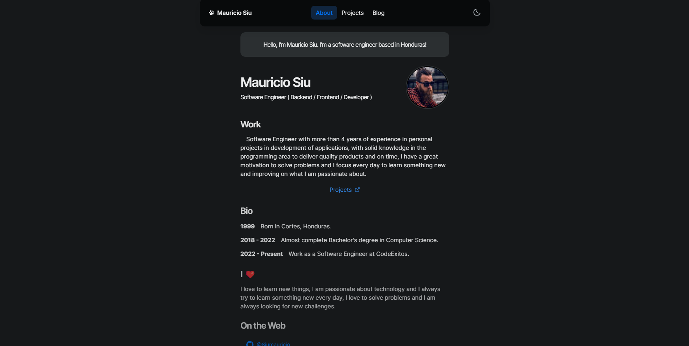

# NextJS and NextUI Portfolio

You can deploy here directly to vercel [](https://vercel.com/import/project?template=https://github.com/Siumauricio/portfolio)

This is a template for NextJS and NextUI. 

[NextJS](https://nextjs.org/) 
[NextUI](https://nextui.org/)

You can see the demo here: https://portfolio-de3p.vercel.app/




- About Section
- Projects Section
- Dark Mode Support
- Full Responsive
- Blog section (coming soon)


```
├── components
│   ├── animations          # Base animations for screens
│   ├── content             # Content for each section
│   ├── footer              # Footer component
|   ├── icons               # Icons for the project
|   ├── layout              # Layout components
|   ├── navbar              # Navbar component
|   ├── styles              # Some reusable components
├── pages                   # Documentation files 
│   ├──  _app.tsx           # Entry point for the app
│   ├──  index.tsx          # About page
│   ├──  projects.tsx       # Projects Page
│   ├──  blog.tsx           # Blog Page
│   ├── more...             # Soon
└──
```
## For Run

Install dependencies

    
```bash
npm install
```

Start the server
        
```bash
npm run dev
```

Now you can visit https://localhost:3000 in your browser.
